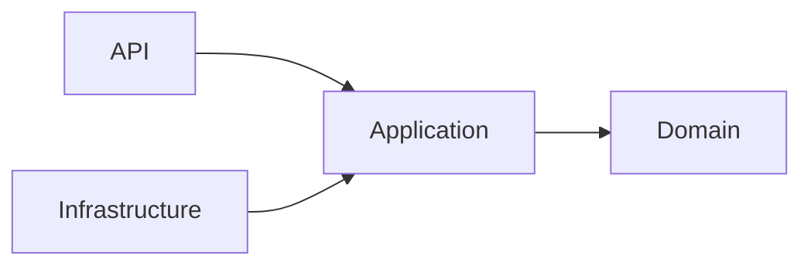

# Decision format

Use one block per decision. It stays terse: a future builder reads it as a rule, not a story.

```markdown
### AD-{n} — {decision in a few words} [ADOPTED]

- **Binds:** {FR/NFR IDs, epics, layers or projects, or `all`}
- **Prevents:** {the divergence this stops, e.g. "FE and BE disagreeing on 403 vs 404 for cross-user reads"}
- **Rule:** {an enforceable constraint, phrased so a reviewer can point at a violation}
- **Alternatives considered:** {one line each, why not} <!-- optional; keep short -->
```

`[ADOPTED]` means the user or the existing code already settled it. Omit the tag for a new call.

## Shard skeleton (new shard)

~~~markdown
# {Topic} — Architecture Decisions

**Scope:** {what this governs} · **Altitude:** increment | epic | concern · **Status:** draft | final · **Updated:** {YYYY-MM-DD}

## Inherited Invariants

| Inherited | From | Binds here |
|---|---|---|
| Clean Architecture dependency direction | AGENTS.md / core-architectural-decisions.md | {…} |

## Decisions

### AD-1 — …

## Dependency direction



## Consistency conventions

| Concern | Convention |
|---|---|
| Naming | |
| IDs / dates / error shape | |
| Errors / logging / config | |

## Deferred

- {decision intentionally pushed down} — {why it can wait} — {revisit when}

## Open Questions

- {question} — blocks: {what}
~~~

Cut any section this shard doesn't need. Never leave an empty header or a template comment behind.
