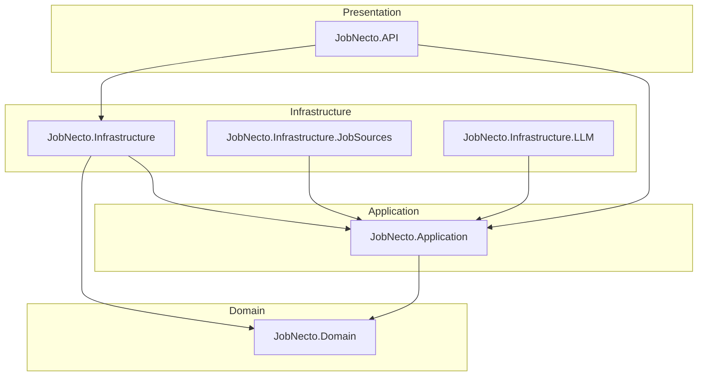

# JobNecto

## Summary

JobNecto is a **.NET 10** backend API focused on **job vacancy aggregation and matching**. The codebase follows **Clean Architecture**: domain and application rules stay independent from infrastructure and HTTP details, so features like persistence, external job sources, and LLM integrations can evolve behind stable interfaces.

## Description

The solution is intentionally **API-first** and now exposes the first production API routes for onboarding and auth token renewal under `/api/v1/users`. The root URL may still return **404**, which is expected for this stage. In **Development**, the app exposes **OpenAPI** so contracts and tooling can be exercised early.

The **domain model** already includes core concepts for the product direction, for example **vacancies** (title, company, location, salary, skills, job source, match hints), **users**, **resumes**, **education**, **cover letters**, and configuration for **LLM providers**. Application interfaces define **repositories** and **unit of work**; concrete implementations belong in **Infrastructure** and related projects.

**PostgreSQL** (via **EF Core** and **Npgsql**) is the intended primary store. Packages for **Redis** and **Quartz** are referenced for planned caching and scheduling; they are not fully wired in the application yet. See [AGENTS.md](AGENTS.md) for environment notes and caveats.

## Architecture

Layers and projects (solution: `backend/JobNecto.slnx`):

| Layer / area | Project | Role |
|--------------|---------|------|
| API | `JobNecto.API` | ASP.NET Core host, OpenAPI in Development, HTTPS redirection |
| Application | `JobNecto.Application` | Application services patterns; interfaces such as `IRepository`, `IVacancyRepository`, `IUnitOfWork` |
| Domain | `JobNecto.Domain` | Entities, enums, value objects (e.g. vacancies, users, resumes, pagination, filters) |
| Infrastructure | `JobNecto.Infrastructure` | EF Core, PostgreSQL; Redis and Quartz dependencies (see csproj) |
| Job sources | `JobNecto.Infrastructure.JobSources` | Adapters and integration for external job feeds |
| LLM | `JobNecto.Infrastructure.LLM` | LLM provider–related infrastructure |
| Tests | `JobNecto.Tests` | Automated tests |

Dependency direction is **inward**: API and Infrastructure depend on Application and Domain; Domain does not depend on outer layers.



## Requirements

- **[.NET 10 SDK](https://dotnet.microsoft.com/download)** (CI uses `10.0.x`)
- **PostgreSQL** when database features and EF migrations are used locally (see Development connection string below)

## How to use

### Build and test

From the **repository root**:

```bash
dotnet restore backend/JobNecto.slnx
dotnet build backend/JobNecto.slnx
dotnet test backend/JobNecto.slnx
```

CI-equivalent (warnings as errors, Release):

```bash
dotnet build backend/JobNecto.slnx --configuration Release --warnaserror
dotnet test backend/JobNecto.slnx --configuration Release --no-build --warnaserror
```

> Use **`backend/JobNecto.slnx`** for all CLI operations. The root `Jobnecto.sln` uses legacy path style and does not include the test project.

### Run the API locally

```bash
cd backend/src/JobNecto.API
ASPNETCORE_ENVIRONMENT=Development DOTNET_URLS="http://localhost:5000" dotnet run
```

Smoke checks:

```bash
curl -i http://localhost:5000/openapi/v1.json
curl -i http://localhost:5000/
```

- **`GET /openapi/v1.json`** — should return **200** in Development.
- **`GET /`** — **404** is expected until public routes exist.

### Current API surface

- `POST /api/v1/users`
  - Creates a user account, persists password as PBKDF2 hash, sets HTTP-only auth cookie, returns `201 Created`.
- `POST /api/v1/users/token/refresh`
  - Requires authentication, renews JWT cookie, and returns body token only for bearer transport clients.
- `GET /api/v1/users/me`
  - Returns the authenticated user's core profile (id, loginName, email, phone, location, about, avatar, timestamps).
- `PATCH /api/v1/users/me`
  - Partial profile update for the authenticated user (Story 1.4).
- `POST|PUT|DELETE /api/v1/users/me/avatar`
  - Avatar management endpoints (upload/update/remove avatar). Authentication required.
- `POST /api/v1/resumes`
  - Creates a resume for the authenticated user and returns `201 Created` with the created resource and `Location` header. `title`, `skills`, and `workLocationType` are optional; when provided, enum and length validation still applies.
- `GET /api/v1/resumes`
  - Returns a cursor-paginated list of resumes for the authenticated user (`pageSize`, `lastSeenId`, `lastSeenUpdatedAt`).

### CORS

CORS is configured via the `Cors:AllowedOrigins` array in `appsettings.json`. The API registers a named policy called `Frontend` that allows `GET`, `POST`, `PUT`, `PATCH`, and `DELETE` with the `Authorization`, `Content-Type`, and `Accept` headers.

**Development** — `appsettings.Development.json` already includes the Vite dev-server origins:

```json
"Cors": {
  "AllowedOrigins": [
    "http://localhost:5173",
    "https://localhost:5173"
  ]
}
```

**Production** — supply origins through environment variables using .NET's double-underscore convention (one origin per indexed entry):

```bash
Cors__AllowedOrigins__0=https://app.example.com
Cors__AllowedOrigins__1=https://www.example.com
```

Or use `appsettings.Local.json` (git-ignored) for developer-specific overrides.

### PostgreSQL (development)

`appsettings.Development.json` in the API project expects a connection similar to:

`Host=localhost;Port=5432;Database=JobNecto;Username=admin;Password=admin`

Start PostgreSQL when needed (example for PostgreSQL 16 on Debian/Ubuntu):

```bash
sudo pg_ctlcluster 16 main start
```

Apply EF Core migrations when Infrastructure is wired to startup (example):

```bash
dotnet ef database update --project backend/src/JobNecto.Infrastructure --startup-project backend/src/JobNecto.API
```

For more database workflows, see [AGENTS.md](AGENTS.md) and the project skill for PostgreSQL under `.cursor/skills/`.

## Continuous integration

GitHub Actions (`.github/workflows/ci.yml`) runs **restore**, **build**, and **test** on pushes to `master` and on pull requests.

## Comprehensive PR review workflow

Use the mandatory comprehensive review process whenever a PR is opened or updated.

### Manual command

From repo root:

```bash
bash scripts/run_code_reviewer.sh
```

Optional arguments:

```bash
bash scripts/run_code_reviewer.sh <base-ref> <report-dir>
```

Examples:

```bash
bash scripts/run_code_reviewer.sh origin/master /tmp
```

Output:

- Runs build/test checks in Debug and Release (warnings as errors in Release).
- Generates a markdown report at `/tmp/code_review_report_<timestamp>.md` with:
  - changed files
  - check outputs
  - heuristic `risk_score` (1-10) and risk notes

### Dedicated reviewer skill

For agent-driven review, use:

- `.cursor/skills/code-reviewer/SKILL.md`

This skill requires running a separate subagent with description `Code reviewer` and producing severity-ranked findings with `risk_score`, impact, evidence, and recommended fixes.

### IDE commands (manual trigger)

If your IDE supports `.cursor/commands`, run:

- `/code-reviewer`
- `/function-comments`

Optional:

- `/code-reviewer origin/master`
- `/function-comments backend/src/JobNecto.Application`
- `/function-comments backend/src/JobNecto.Domain/Entities/Resume.cs`

Command files:

- `.cursor/commands/code-reviewer.md`
- `.cursor/commands/function-comments.md`

The `code-reviewer` command instructs the agent to run the mechanical report script and execute a dedicated `Code reviewer` subagent workflow.

The `function-comments` command instructs the agent to add C# XML documentation for non-trivial functions in the requested scope. With no arguments, it scans `backend/src` in dependency order and skips boilerplate per `.cursor/skills/function-comments/SKILL.md`.

### Dedicated agent profiles

Repository agent profiles:

- `.cursor/agents/code-reviewer.md` — dedicated reviewer behavior and required risk-scored output format
- `.cursor/agents/function-comments.md` — optional subagent for large `function-comments` runs (follows the skill)

## Future features

The following are **directional** items implied by the solution structure and dependencies; timelines are not fixed here.

- **HTTP surface**: Expand beyond current user onboarding + token refresh to include profile, vacancy, resume, education, and cover-letter resource endpoints.
- **Infrastructure**: Register Infrastructure services in the API host where appropriate; use PostgreSQL for reads/writes; optional **Redis** caching and **Quartz**-based jobs when requirements solidify.
- **Integrations**: Expand **JobNecto.Infrastructure.JobSources** for ingestion from multiple boards and feeds; use **JobNecto.Infrastructure.LLM** for ranking, summarization, or matching assistance.
- **Operations**: Non-placeholder container images and compose files when deployment stories are defined (current Docker assets in `docker/` may be stubs).

## Repository layout (high level)

- `backend/` — main .NET solution, source, and tests
- `docker/` — Docker-related placeholders (verify before relying on them)
- `AGENTS.md` — agent and maintainer notes for this repo

## License

No license file is present in this repository at the time of writing; confirm with the maintainers before redistributing or reusing the code.
