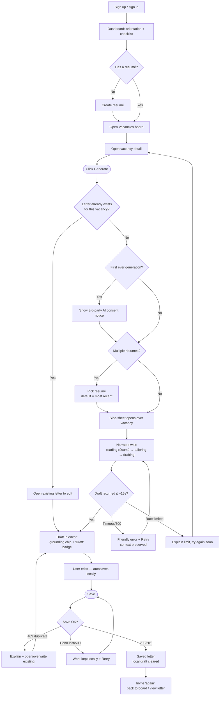
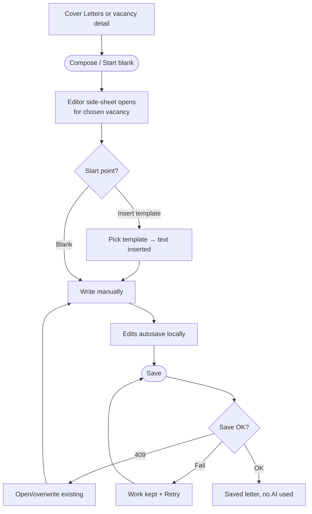
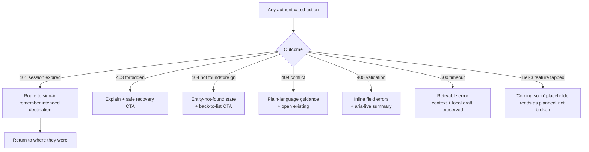

---
stepsCompleted:
  - step-01-init
  - step-02-discovery
  - step-03-core-experience
  - step-04-emotional-response
  - step-05-inspiration
  - step-06-design-system
  - step-07-defining-experience
  - step-08-visual-foundation
  - step-09-design-directions
  - step-10-user-journeys
  - step-11-component-strategy
  - step-12-ux-patterns
  - step-13-responsive-accessibility
  - step-14-complete
lastStep: 14
status: complete
decisions:
  visualIdentity: hybrid (FE Guide token structure + Career OS palette/type)
  specDepth: deep on net-new (generation, editor, vacancy board/detail, placeholders, dashboard); lighter on CRUD
  navigation: flat sidebar — add Vacancies + Cover Letters as peers
inputDocuments:
  - e:\apps\Jobnecto\_bmad-output\planning-artifacts\prd-demo-mvp.md
  - e:\apps\Jobnecto\_bmad-output\project-context.md
  - e:\apps\Jobnecto\docs\FRONTEND_IMPLEMENTATION_GUIDE.md
  - e:\apps\Jobnecto\frontend\design-examples\ (15 reference PNGs — non-binding visual references)
---

# UX Design Specification Jobnecto — Demo MVP

**Author:** Timmy
**Date:** 2026-05-26

---

<!-- UX design content will be appended sequentially through collaborative workflow steps -->

## Executive Summary

### Project Vision

The Jobnecto Demo MVP is an evidence-gathering instrument in the shape of a product. Its single purpose is to answer one question with data instead of opinion: _is AI-assisted cover-letter generation good enough to build the rest of the product around?_ Every UX decision serves that purpose. The design must make the product feel **whole and honest** — genuinely functional where the backend is real (Tier 1), real-feeling UI over seeded data where it's mocked (Tier 2), and unmistakably _previewed-not-broken_ where it isn't built yet (Tier 3) — because the credibility of the surface is what makes the UI/UX feedback trustworthy.

The design centerpiece is the **Generate** interaction: the moment a job-seeker turns writer's block into a tailored draft grounded in their own resume and a specific vacancy. The surrounding CRUD (profile, resume, education, templates, letters) is the runway; the generation _is_ the product.

### Target Users

**Daria — mid-level frontend developer, actively job-hunting; the founder's friend who agreed to try the demo and tell the truth.** She juggles four job boards, rewrites the same cover letter endlessly, and is _skeptical of AI tools that produce generic fluff_. Her skepticism is a design constraint, not a footnote: the product earns her trust by being honest about what's real, by visibly grounding generation in her own words, and by **not forcing AI on her** (she can compose manually or from her own saved template). The demo is single-actor — no admin, ops, or third-party consumers this round. Desktop-primary (testers on laptops), but core create/edit flows stay usable on mobile.

### Key Design Challenges

1. **The Generate experience (net-new).** A ≤15s synchronous wait that must feel alive rather than frozen; grounding in the user's resume must be _visible_ and reassuring; output framed firmly as an editable draft (mitigating the fabrication risk by design); slow/failed generation recovers via retry without losing context.
2. **An honest placeholder system.** A consistent, dignified "coming soon" treatment across AI match score, job-source connect, application tracking, and multi-provider config — reading as intentional and planned, never half-built or broken, so it can't pollute the feedback.
3. **Information architecture growth.** The product's center of gravity shifts to Vacancies and Cover Letters; navigation, dashboard orientation, and the cross-links between resume → vacancy → generate → save must make the spine completable _without instructions_.
4. **Hybrid visual system.** Reconcile the FE Guide's disciplined token structure with the Career OS palette and serif-italic personality into one coherent, documented system.
5. **Desktop-primary, mobile-usable, with a non-negotiable a11y floor** — semantic structure, full keyboard navigation with visible focus, labeled inputs, `aria-live` error announcements, reduced-motion honored.

### Design Opportunities

- **Make Generate a signature interaction** — the thing a tester describes to a friend afterward; the anticipation, the reveal, and the "it knew my resume" moment are designable.
- **Turn the fabrication risk into a trust moment** — "draft, not done" framing and mandatory human review become a _feature_ Daria respects, converting her skepticism into confidence.
- **Lean on first-run orientation** — the dashboard's onboarding checklist (already strong in the design references) carries the no-instructions goal.
- **Let the Career OS identity sell "real product"** — a distinctive, confident look makes a friends-round demo feel shipped, not sketched, raising the quality and seriousness of the feedback.

## Core User Experience

### Defining Experience

The product's core loop is **find a role → generate a tailored letter → make it yours → save it**: from a vacancy detail page, the user clicks **Generate**, watches a brief grounded wait, and receives a draft that visibly reflects _their_ resume and _this_ role — which they edit and save as the one letter for that vacancy. This loop is the entire reason the product exists, and it must be completable on a first visit without instructions.

A deliberate **second path** sits beside it for the AI-skeptical user: start from a saved template (or a blank editor) and compose manually — same editor, same save, no LLM. The product offers intelligence without _imposing_ it.

Everything else — auth, profile, resume/education/template CRUD, the vacancy board — is **runway that feeds or frames** the loop. Resume quality is the fuel for generation; the board is the on-ramp; the dashboard orients the first run.

### Platform Strategy

- **Angular / TypeScript SPA**, client-side rendered, served as a static bundle against the existing .NET 10 REST API. No SSR, no SEO — every meaningful route is auth-guarded; testers arrive via direct link.
- **Authenticated private tool**, not a public site: only sign-up and sign-in are unguarded; everything else requires a valid HTTP-only cookie session.
- **Mouse/keyboard primary, touch-supported.** Desktop-primary because testers are on laptops; core create/edit/generate flows must remain _usable_ (not pixel-perfect) on mobile via card layouts and full-screen/bottom-sheet forms on `xs/sm`.
- **No offline mode, no real-time.** Generation is synchronous request/response with a loading state — no websockets/streaming this round.
- **Evergreen browsers only** (latest 2 of Chrome, Edge, Firefox, Safari); smoke-tested on Chromium + Firefox + WebKit.

### Effortless Interactions

- **Generate should feel like one decisive click**, not a form to fill — the user's resume and the open vacancy are the inputs; the system assembles the rest. No "configure your generation" ceremony.
- **The vacancy → letter handoff carries context automatically** — opening Generate from a vacancy pre-binds that vacancy and the user's relevant resume; the user never re-enters what the system already knows.
- **Save respects "one letter per vacancy"** silently where possible — the editor knows whether this vacancy already has a letter and routes to edit-in-place rather than letting the user collide with a 409 by surprise.
- **Inserting a template** drops its text into the editor as a starting point in one action — no copy-paste, no modal gymnastics.
- **First-run orientation is automatic** — the dashboard checklist and "Recent resumes" surface the next best action without the user hunting for it.

### Critical Success Moments

- **The reveal (make-or-break):** the generated draft references the user's actual skills and this specific role. If it reads generic, the demo fails its core hypothesis — so the UI must _show_ the grounding (e.g., which resume fed it) and frame output as a starting draft, not a finished verdict.
- **First completable spine:** a first-time user reaches a saved letter with zero instructions. This is where the "feels like a real product" judgment is won or lost.
- **Graceful wobble:** slow/failed generation offers retry without losing context; an expired session returns the user to where they were; a duplicate-letter attempt explains rather than crashes; a "coming soon" tile reads as _planned_, not _broken_. Each of these, mishandled, would taint the feedback.
- **The "again" moment:** after the first save, the user _wants_ to do it for the next role — the loop should invite repetition.

### Experience Principles

1. **Mock the plumbing, never the magic.** Where it's real (generation, CRUD), it's genuinely real and polished; where it's mocked or unbuilt, it's _honestly_ labeled — never faked, never broken-looking.
2. **The draft is a beginning, not a verdict.** Always frame AI output as an editable draft the user finishes and owns — turning the fabrication risk into a trust-building moment.
3. **Offer intelligence, don't impose it.** The manual/template path is a first-class citizen beside Generate; respecting the user's control earns the skeptic's trust.
4. **No dead ends, ever.** Every destination resolves to a working feature, a clear empty state, an actionable error, or an intentional placeholder. The surface always feels whole.
5. **Carry the context for the user.** The system remembers the resume, the vacancy, the intended destination — so the human spends effort on judgment, not on re-entering what's already known.

## Desired Emotional Response

### Primary Emotional Goals

The feeling we're designing for is **earned trust that turns into relief** — the quiet exhale of _"oh — this actually understood me, and I'm still in control."_ Not dazzle, not novelty. Daria is skeptical of AI fluff, so delight here is the delight of being _taken seriously_: a tool that knows her résumé, respects her judgment, and hands back twenty reclaimed minutes. If she tells a friend, the sentence we want is **"it didn't sound like a robot — it sounded like me, and I just tweaked it."**

### Emotional Journey Mapping

- **First arrival (sign-up → dashboard):** _Oriented, not overwhelmed._ "I know what to do next" — the checklist and clean shell make a friends-round demo feel like a real, shipped product, raising her seriousness as a tester.
- **Building the runway (profile, résumé):** _Competent and unhurried._ Familiar, low-friction CRUD that never makes her feel she's "feeding a machine" — she's curating _herself_.
- **The wait (Generate clicked):** _Anticipation, not anxiety._ The pause feels alive and purposeful — visibly working _from her résumé_ — so the seconds read as care, not lag.
- **The reveal (draft appears):** _Pleasant surprise → relief._ "It referenced my actual skills and this role." This is the hinge of the whole demo.
- **Making it hers (edit → save):** _Ownership and control._ The draft is clearly a starting point she finishes; saving feels like _her_ work, not the AI's.
- **When things wobble:** _Reassured, never stranded._ A slow/failed generation, an expired session, a duplicate letter — each handled so she feels held, not dropped.
- **Returning (a week later):** _At home._ Her materials are still here, scoped to her, editable — the product feels like _hers over time_, and she reaches for it again.

### Micro-Emotions

The decisive battles for this product:

- **Trust over skepticism** — the single most important conversion; everything else is downstream of it.
- **Confidence over confusion** — she always knows where she is, what's real, and what's coming.
- **Anticipation over anxiety** — the generation wait builds expectation rather than dread.
- **Ownership over passivity** — she finishes and owns the letter; the AI assists, never authors.
- **Reassurance over abandonment** — errors and edges feel caught, not crashed.

### Design Implications

- **Trust over skepticism** → Visible résumé grounding on the generated draft ("drafted from: _Senior Frontend Engineer_"); honest "coming soon" placeholders that never masquerade as bugs; a real, confident visual identity that signals "shipped product."
- **Confidence over confusion** → First-run checklist and "next best action" cues; consistent nav with every destination resolving somewhere; clear page titles and a path back to safety (the 404 "Back to resumes" pattern).
- **Anticipation over anxiety** → A purposeful generation loading state that names what's happening ("Reading your résumé… tailoring to this role…") with a calm, reduced-motion-safe animation — never a bare spinner or frozen screen; honest timeout → retry path.
- **Ownership over passivity** → "Draft" framing in the editor, a one-action insert-template path, and the manual/compose path given equal visual weight to Generate — the AI is offered, never imposed.
- **Reassurance over abandonment** → Every data view has loading / empty / error states; 401 returns her to where she was; 409 explains ("you already have a letter for this role") and routes to edit; failures are retryable, never fatal.

### Emotional Design Principles

1. **Earn trust before asking for it.** Show the grounding, frame the draft, label the unbuilt honestly — credibility is the product's currency with a skeptic.
2. **The pause is part of the magic.** Treat the generation wait as a designed moment of anticipation, not dead time to hide.
3. **She finishes; the AI starts.** Every interaction reinforces that the human owns the output.
4. **Never leave her stranded.** No dead ends, no silent failures — reassurance is built into every edge.
5. **Calm confidence over flashy delight.** Restraint and honesty serve a skeptical professional better than animation or surprise.

**Emotions to avoid:** feeling _sold to_, _replaced_, _patronized_, _stranded_, or _misled about what's real_.

## UX Pattern Analysis & Inspiration

### Inspiring Products Analysis

**LinkedIn — the domain's mental model (and its cautionary tale).**

- _Does well:_ Users already know the **profile → jobs → apply** spine; the **"profile strength" meter** is the canonical completeness nudge (our dashboard's "Profile complete 83%" is exactly this lineage). Job search with faceted filters and a clean detail view is a learned pattern we inherit for free.
- _Cautionary:_ Feed clutter, notification spam, engagement-bait, and growth dark patterns. LinkedIn teaches us the _structure_ to adopt and the _noise_ to refuse.

**Teal — the closest functional sibling.**

- _Does well:_ A focused career toolkit — résumé builder, **multiple résumé versions** ("different versions of yourself," echoed in the dashboard tip), **AI cover-letter generation grounded in résumé + job description**, and a **job-match score** with explanation. It frames AI output as an editable draft and keeps the tone professional, not gimmicky.
- _Transfers directly:_ our Generate flow, the multi-résumé concept, and the Tier-3 AI-match-score placeholder (we can _preview_ Teal's match pattern honestly).

**Huntr — the organization layer.**

- _Does well:_ A **save-a-job → pipeline/kanban** tracking model and lightweight autofill. Clean, calm, organized.
- _Transfers as future:_ our Tier-3 application/response tracking — Huntr's pipeline is the pattern we'll preview now and build later.

### Transferable UX Patterns

**Navigation & information hierarchy**

- **Profile/résumé completeness nudge** (LinkedIn strength meter → our dashboard checklist) — adopt; already validated in the design references.
- **Job board with faceted filters + detail view** (LinkedIn/Teal) — adopt for the vacancy board and detail; filters as chips, card layout on mobile.

**Interaction**

- **AI cover letter grounded in résumé + this role, returned as an editable draft** (Teal) — the core of our Generate moment; make the grounding _visible_ ("tailored from _Senior Frontend Engineer_ × this role").
- **Multiple résumé versions, pick the right one per application** (Teal) — informs résumé selection at generation time.
- **Insert-a-starting-point** (template/snippet, Notion-style) — one action to seed the editor; respects the manual path.
- **Save-to-pipeline** (Huntr) — previewed now as the Tier-3 application-tracking placeholder.

**Visual**

- **Calm, professional, restrained** (Teal over LinkedIn) — supports our "earned trust over dazzle" emotional goal and the Career OS identity.
- **Match score as a labeled, explainable signal, not a mysterious number** (Teal) — sets the bar for our Tier-3 match-score placeholder.

### Anti-Patterns to Avoid

- **Feed/engagement clutter & notification spam** (LinkedIn) — conflicts with a focused private tool; nothing competes with the core loop for attention.
- **Generic, "obviously-AI" output** (the whole category's failure mode) — the exact thing that makes Daria skeptical; mitigated by résumé-grounding and draft framing.
- **Manipulative completeness nagging / gamification** — the checklist must feel _helpful_, not guilt-trippy; it nudges, it never shames.
- **Forcing AI with no manual escape** — violates "offer intelligence, don't impose it"; the template/manual path stays first-class.
- **Half-built features masquerading as finished** (common in early competitors) — countered by our honest Tier-3 placeholder system.
- **Dense desktop tables dumped onto mobile** — use card layouts on `xs/sm` (FE guide rule).

### Design Inspiration Strategy

**Adopt**

- The **profile/résumé → vacancy → apply** spine and **completeness nudge** — because users arrive already fluent in it (LinkedIn).
- **Faceted job board + detail** and **résumé-grounded AI draft you edit** — because they _are_ our core experience, proven by Teal.

**Adapt**

- **Match score & application tracking** — preview Teal/Huntr's patterns as honest, labeled Tier-3 placeholders rather than building them now.
- **Completeness nudges** — keep LinkedIn's usefulness, drop its pressure; framed as orientation for a first-time tester.

**Avoid**

- LinkedIn's **clutter, spam, and dark patterns**; the category's **generic-AI fluff**; **forced-AI** flows; and **half-features pretending to be whole**.

This keeps Jobnecto recognizably part of the job-tools family Daria trusts, while winning on the two things competitors fumble: **honesty about what's real** and **AI that sounds like her**.

## Design System Foundation

> **Architect ratification note:** The PRD defers final state/form/stack calls to architecture. The kit recommendation below (spartan-ng) is a **UX-side recommendation pending architect ratification**; the _decision that matters_ is the category (themeable third-party on accessible primitives) and the token-driven hybrid-identity approach — the specific library can be swapped without changing the UX direction.

### 1.1 Design System Choice

**A themeable third-party foundation, with spartan-ng as the recommended kit.** spartan-ng provides unstyled, accessible primitives ("brain") built on **Angular CDK** (overlay, focus management, live-announcer, a11y), paired with Tailwind-based UI components ("helm") that we copy into the repo and restyle freely. The bespoke component contracts already in the FE Guide (`TextField`, `SelectField<T>`, `TagInput`, `AvatarUploader`, `ResumeForm`, `EducationForm`) are implemented as thin, branded wrappers over these primitives.

_Alternatives considered:_ **PrimeNG** (largest component set, strong theming via design tokens, but a heavier enterprise feel to override) and **Taiga UI** (excellent quality and a11y, but a distinctive built-in look to theme away). Either remains a viable fallback if spartan-ng's coverage gaps prove costly.

### Rationale for Selection

- **Serves the hybrid identity directly.** Headless primitives + Tailwind means we own 100% of the visual layer — cream canvas, near-black nav/CTAs, royal-blue + lime accents, serif-italic personality — without fighting a library's opinions. This is exactly the "FE Guide structure + Career OS skin" decision made earlier.
- **Accessibility comes from the foundation.** Angular CDK underneath gives us focus trapping, overlays, live-region announcements, and keyboard semantics — directly supporting our non-negotiable a11y floor and WCAG 2.2 AA target, instead of hand-rolling ARIA.
- **Right effort for parallel agent tracks.** Medium build, medium theming — faster than a fully custom kit, lighter to brand than Material. Components live in-repo, so the frontend track isn't blocked waiting on a dependency's theming API.
- **Maps onto the existing FE handoff.** The FE Guide already describes our components as custom contracts; spartan-ng gives those contracts an accessible, themeable home rather than reinventing primitives.

### Implementation Approach

- **Tokens as the single source of truth.** Author the FE Guide token set (reconciled to the Career OS palette/type) as TS/JSON → exported to CSS custom properties → consumed by Tailwind's theme config. Components reference tokens, never hard-coded values.
- **Primitive → branded-wrapper layering.** spartan-ng brain primitive → helm component (restyled) → app-level branded component matching the FE Guide contract. App code imports only the branded layer.
- **Tailwind as the styling engine**, configured from tokens (colors, spacing scale 4–48, radius sm/md/lg/pill, shadow sm/md/lg, motion durations/easings, z-index). Dark mode out of scope this round.
- **Typography:** sans (e.g., Manrope or equivalent) for UI; a serif (italic) display face reserved strictly for personality accents ("Job_necto_", greetings, hero lines) — never for body or controls.
- **Feature-sliced placement:** the kit lives in `shared/ui`; branded domain components compose upward into `features`/`widgets`/`pages` per the FE Guide blueprint.

### Customization Strategy

- **Theme by token override, not component forking** — palette, type, radius, and motion all flow from the token layer so a future re-skin is a token change, not a component rewrite.
- **Define a tight component inventory first** (buttons, inputs, select, tag input, chips, cards, dialog/sheet, toast, skeleton, alert/banner, avatar, nav, badge/"coming soon" pill) and brand those; avoid pulling in unused library surface.
- **Bridge any coverage gaps** (e.g., the rich cover-letter editor, the generation loading affordance) as bespoke components on CDK primitives, styled from the same tokens — so net-new screens stay visually consistent with the kit.
- **Reduced-motion + AA baked into the kit**, not bolted on per screen: `prefers-reduced-motion` honored in shared motion utilities; focus-visible rings, hit-target sizing (≥24px), and label/`aria-describedby` wiring standardized in the branded form components.

## 2. Core User Experience

### 2.1 Defining Experience

**"Click Generate on a job, get a cover letter that sounds like you."** From a vacancy detail page, one decisive click turns the user's résumé and that specific role into a tailored draft in seconds — which they read, lightly edit, and save. This is the sentence Daria says to a friend ("it didn't sound like a robot — it sounded like me"), the moment she judges the product real, and the single interaction that, done right, makes every surrounding feature worth having.

Sitting beside it, with equal dignity, is the **manual/template path**: compose from scratch or insert a saved template into the same editor — no AI. The defining experience is _offering_ generation, not _forcing_ it.

### 2.2 User Mental Model

- **What users do today:** open a blank doc (or last application's letter), copy-paste their résumé highlights, manually rephrase for the new role, second-guess the tone, and lose 20–30 minutes per application. They already "tailor a letter to a job" — that mental model is intact; we're collapsing its cost.
- **What they expect:** because of Teal/ChatGPT-era tools, users now expect "give it my background + the job → get a draft." The expectation is _draft, not final_; they assume they'll edit. We meet that expectation rather than inventing a new metaphor.
- **Where they get burned (and skeptical):** generic output that ignores their actual experience; tools that hide the job description's influence; AI that fabricates skills (actively dangerous in a real application); and tools that _replace_ their voice instead of _starting_ it.
- **The trust gap to close:** Daria's doubt is "will this just be fluff?" The design answers by making the **grounding visible** (this résumé × this role) and the **draft framing explicit** (you finish it, you own it).

### 2.3 Success Criteria

The core interaction succeeds when:

- **It's one click, not a form.** No "configure your generation" step — résumé + open vacancy are the inputs; the system assembles the prompt.
- **The output is visibly grounded.** The draft references the user's real skills/experience and the specific role; the UI names what fed it ("Drafted from _Senior Frontend Engineer_ for _this role_").
- **It feels fast and alive.** A draft returns within ~15s typical; the wait is a designed, narrated moment, never a frozen screen.
- **It's unmistakably a draft.** Output lands in an editable editor framed as a starting point, never auto-saved to the server, never presented as final.
- **Work is never lost.** An in-progress draft — generated or manually edited — survives an accidental tab close, refresh, navigation away, or connection drop, and can be restored when the user returns.
- **Recovery is graceful.** Slow/failed/timed-out generation offers retry without losing context; a rate-limit or provider error explains and stays recoverable.

**Success indicators:** the user edits _lightly_ (not rewrites wholesale); they save and immediately want to do it again for another role; in feedback they describe the letter as "mine," not "the AI's."

### 2.4 Novel UX Patterns

**This is established patterns combined with care, not a novel interaction to teach.** Users already understand "generate a draft, then edit." Our differentiation isn't a new gesture — it's _trustworthiness within the familiar pattern_:

- **Visible grounding** — surfacing _which résumé_ and _which role_ produced the draft (familiar from "sources" UIs, applied to cover letters).
- **The narrated wait** — turning a plain spinner into a phase-named progress moment ("Reading your résumé… matching to this role… drafting…"), reduced-motion-safe.
- **Draft-and-own framing** — explicit "this is a draft to make yours" language and an editor that feels like _authoring_, not _accepting_.
- **The honest opt-out** — the manual/template path given equal visual weight, so generation never feels coerced.

No user education or onboarding tutorial is required; the pattern is self-evident. Our "unique twist" is restraint and honesty, not invention.

### 2.5 Experience Mechanics

**1. Initiation**

- Entry point: a prominent **Generate cover letter** primary action on the **vacancy detail** page (and a secondary entry from the vacancy card).
- On click, the system pre-binds **this vacancy** and the user's résumé. If the user has multiple résumés, a lightweight résumé selector appears (defaulting to most recent), so the user confirms _which version of themselves_ to use — otherwise it's zero-input.
- **First-time consent (FR29):** before the first generation, a concise, non-blocking notice states that the résumé + vacancy are sent to a third-party AI provider; acknowledged once, then remembered (with a persistent, quiet reminder near the action thereafter).
- **One-letter-per-vacancy awareness:** if a saved letter already exists for this vacancy, the entry routes to _edit the existing letter_ rather than generate a colliding second one.

**2. Interaction**

- The user clicks once. No prompt-writing, no parameters.
- The system calls `POST /api/v1/cover-letters/generate` (vacancyId + résumé reference) — returns a **draft only; does not persist**.
- The draft lands in the **cover-letter editor**, pre-filled and immediately editable. The user edits inline; the manual/template tools remain available in the same editor (insert template, clear, start over).

**Draft resilience (cross-cutting):**

- The active draft is held in a **client-side store (state manager + `localStorage`/IndexedDB)** and **autosaved on edit** (debounced), keyed to user + vacancy. This is purely local — it is _not_ server persistence (`/generate` still returns a non-persisted draft) and the text is never sent to logs.
- **Restore on return:** reopening the editor for a vacancy with an unsaved local draft prompts **"You have an unsaved draft for this role — restore or discard?"** before overwriting.
- **Lifecycle:** the local draft is cleared once the user **Saves** (server becomes the source of truth) or explicitly **Discards**; a successful Save reconciles local → server.
- **Connection-loss feedback:** if Save fails due to a dropped connection, the edited text remains safe in the local store and the user is told their work is kept and can retry — never lost.

**3. Feedback**

- **During (≤15s typical):** a narrated loading state with phase labels ("Reading your résumé… tailoring to this role… drafting…"), calm motion, and an unobtrusive note that this can take a few seconds — never a bare spinner, never a frozen screen.
- **On arrival:** the editor populates with a subtle reveal; a **grounding chip** names the source résumé and role; a clear **"Draft — review before saving"** label sets expectations.
- **Autosave cue:** a quiet "Draft saved locally" indicator reassures the user their edits are safe between server saves.
- **On slow/failure/timeout (NFR1, NFR11, FR30):** at the ~30s hard timeout (or provider error) the user sees a clear, friendly message with a **Retry** that preserves all context; any text the user already typed is never lost.
- **On rate-limit (NFR12):** an explanatory message ("you've generated several letters quickly — try again shortly"), not a cryptic 429.

**4. Completion**

- The user finishes editing and clicks **Save**, persisting via the existing `POST /api/v1/cover-letters` (vacancyId in body) — saving _their edited version_ (FR28/FR32).
- **Success outcome:** a saved cover letter, scoped to the user, tied to that vacancy, visible in their cover-letter list/detail with vacancy context. On success the local draft is reconciled and cleared.
- **409 handling:** if a letter already exists for the vacancy at save time, the user is told clearly and offered to open/overwrite the existing one — never a dead-end error.
- **Failed save:** local state is preserved for retry (see draft resilience).
- **What's next:** a gentle invitation to the "again" moment — return to the board, or view the saved letter — keeping the loop inviting to repeat.

## Visual Design Foundation

> **Source & method:** Brand is derived from the project's design-example screenshots (the "Career OS" identity) reconciled with the FE Guide's token _scale_ (spacing, radius, shadow, type sizes, motion). Per the hybrid decision, **palette and type are overridden toward Career OS; structure is kept from the FE Guide.** All values below are the single source of truth for the token layer; hexes are tunable within the same intent (exact blue/lime to be confirmed at implementation).

### Color System

**Color roles (the defining idea): near-black = action, royal blue = brand accent, lime = spark.**

| Token | Value | Role |
|---|---|---|
| `bg.canvas` | `#F6F4EE` | Warm cream app background |
| `bg.surface` | `#FFFFFF` | Cards, inputs, panels |
| `bg.elevated` | `#FBFAF6` | Subtle raised fills |
| `bg.inverse` | `#0E0F12` | Sidebar, primary buttons, TIP/dark cards |
| `text.primary` | `#14151A` | Near-black body/headings |
| `text.secondary` | `#44474F` | Supporting copy |
| `text.muted` | `#8A8D96` | Metadata, hints |
| `text.inverse` | `#FAFAF7` | Text on dark surfaces |
| `action.primary` | `#14151A` (hover `#000`) | **Primary buttons & active nav (near-black)** |
| `brand.accent` | `#2348E0` (hover `#1B36B8`) | **Royal blue — links, emphasis, italic wordmark, focus** |
| `brand.spark` | `#8FE34A` | **Lime — sparing highlight, on dark only** |
| `status.success` | `#15803D` | |
| `status.warning` | `#B45309` (bg `#FDF1D6`) | Matches the 409 amber banner in the references |
| `status.danger` | `#B42318` | Destructive (e.g., "Remove", delete) |
| `status.info` | `#1D4ED8` | |
| `border.default` | `#E6E2D8` | Warm hairline |
| `border.strong` | `#C9C4B6` | |
| `border.focus` | `#2348E0` | Visible focus ring (brand blue) |

**Component mapping:** Primary button = `action.primary` + `text.inverse`; Secondary = `bg.surface` + `text.primary` + `border.default`; Destructive = `status.danger`. Inputs use `border.default` → `border.focus` ring → `status.danger` on error. Links/emphasis use `brand.accent`. Lime is decorative-only and never carries essential meaning.

### Typography System

**Tone: confident, editorial, professional — restraint with personality.** Three families, each with a strict job:

- **Sans (UI workhorse): Manrope** — all body, labels, controls, data. Carries ~95% of the text.
- **Serif italic (personality accent): a transitional display serif** (e.g., _Newsreader_ / _Fraunces_ italic). **Reserved for accents only** — the "Job_necto_" wordmark, the accented word in page titles, and greetings ("Hello, _mira_."). Never body, never controls.
- **Mono (eyebrows & metadata): IBM Plex Mono** — uppercase, letter-spaced eyebrow labels ("LIBRARY", "ACCOUNT", "WELCOME BACK · …"), entity IDs (`R_01HA8X2`), and the "TIP · 01" labels — exactly as in the references.

**Type scale (FE Guide, extended):** `xs 12 · sm 14 · md 16 · lg 20 · xl 28 · xxl 36 · display 44`. **Line heights:** tight 1.2 (headings), base 1.5 (body), relaxed 1.7 (long-form letter content). **Weights:** 400 / 500 / 600 / 700. Body text ≥16px; one `h1` per page.

### Spacing & Layout Foundation

- **Base unit 4px**, scale `4 · 8 · 12 · 16 · 20 · 24 · 32 · 40 · 48`. **Radius:** sm 6 / md 10 / lg 14 / pill 999 (cards favor lg). **Shadow:** sm/md/lg from the FE Guide, used sparingly — the look leans on hairline borders over heavy shadows.
- **Feel: airy and editorial, not dense.** Generous whitespace; content breathes (matches the references).
- **App shell:** fixed **left sidebar nav** (~220–240px) on `lg/xl`; collapses to a top bar + off-canvas drawer on `xs/sm`. Content in a centered column with comfortable max-width (~1040px) and wide gutters.
- **Cards** = white surface + 1px warm border + radius lg + optional shadow-sm, padded `space-6`. **Eyebrow label** pattern (mono uppercase, muted) sits above page/section titles throughout.
- **Layout principles:** (1) one clear primary action per view, rendered near-black; (2) lists become cards on `xs/sm`, never dense tables; (3) detail/edit pages may use a two-column form + context layout on `md+`.

### Accessibility Considerations

- **Contrast:** `text.primary` on `bg.canvas` ≈ 14:1; `brand.accent` blue on cream ≈ 7:1 (AA for links/text). **Lime fails contrast on light backgrounds** → enforced as decorative/on-dark only, never essential text. Body ≥ 4.5:1, large text ≥ 3:1.
- **Focus:** visible `border.focus` ring on every interactive element; no focus traps; full keyboard operability.
- **Forms:** labels tied via `for`/`id`; errors via `aria-describedby` + `aria-live`; hit targets ≥ 24×24px.
- **Color is never the only signal** — status always pairs an icon/text with its hue (e.g., the amber 409 banner has an icon + message).
- **Motion:** `prefers-reduced-motion` honored globally; durations 120/180/260ms; no field-shake on validation (color + helper text only).

## Design Direction Decision

### Design Directions Explored

Rather than explore arbitrary visual themes (the look was already established by the project's reference screenshots and locked as the **hybrid Career OS identity**), this step rendered the committed direction onto the screens the references don't cover — via an openable HTML showcase (`ux-design-directions.html`): the app shell + flat nav (with Vacancies & Cover Letters added), the vacancy board with the Tier-3 match-score stub, the full Generate moment, the draft editor, the failure/timeout banner, and the "coming soon" system. The single genuine fork explored was **where the Generate flow lives**: _Direction A_ (a dedicated full-page editor route) vs _Direction B_ (an overlay/side-sheet over the vacancy detail).

### Chosen Direction

**Direction B — the Generate flow opens as an overlay (side-sheet) over the vacancy detail**, keeping the role visible as live context throughout the narrated wait, draft reveal, and editing. The committed Career OS visual system applies throughout. Shared across the flow: the narrated phased wait, the grounding chip ("Drafted from _<résumé>_ × this role"), the "Draft — review before saving" framing, the local autosave cue, and the equal-weight manual/template buttons.

**Responsive & long-draft mitigations (addressing B's tradeoffs):**

- On `xs/sm` the side-sheet becomes a **full-screen** surface — no cramped editing on mobile.
- An **expand / maximize** control lets the user widen the sheet (or go full-bleed) for long-form editing without leaving context.
- The sheet is a proper modal surface: focus-trapped, `Esc`-dismissible, scroll-locked behind, returns focus to the Generate trigger on close (CDK overlay primitives).
- Closing the sheet **never discards work** — the local autosaved draft persists and is offered for restore on reopen.

### Design Rationale

- **Context preserved = trust.** Keeping the vacancy visible while the draft forms reinforces the "this is grounded in _this_ role" message — directly serving the skeptic's trust gap and the "visible grounding" goal.
- **Fast perceived flow.** No route change keeps the core loop feeling like "one decisive click → draft," supporting the "again" moment and the effortless-interaction principle.
- **The cons are designable away.** B's only real weaknesses (cramped space, mobile/long drafts) are fully mitigated by full-screen-on-mobile + an expand control — so we keep B's context benefit without paying its cost.
- **Coherent with the system.** A side-sheet/overlay is a first-class spartan-ng/CDK pattern, so it stays consistent with the kit and the a11y foundation.

### Implementation Approach

- Build the Generate flow as a **CDK overlay side-sheet** launched from the vacancy detail (and card) Generate action; reuse the same component for the manual/template compose entry.
- **Sheet states:** narrated-loading → draft-reveal/edit → save / retry(timeout) / rate-limit, with the local-draft store wired in (autosave, restore-on-reopen, clear-on-save).
- **Responsive:** `lg/xl` = right side-sheet (~480–560px) with expand-to-wide; `md` = wider sheet; `xs/sm` = full-screen surface.
- **A11y:** focus trap, labelled dialog, `aria-live` for phase/status announcements, restore focus on dismiss, reduced-motion-safe reveal.
- The HTML showcase (`ux-design-directions.html`) stands as the living visual reference for downstream screen-flow and component work.

## User Journey Flows

> Source journeys are the PRD's four narratives (Daria). Below they're designed as interaction flows. Backend error contract honored throughout: **404** on cross-user/detail reads, **403** on forbidden mutation, **409** on duplicate letter, **401** on expired session, **400** validation, **500/timeout** retryable.

### Journey 1 — First letter (the core magic, happy path)

Entry: dashboard → vacancy board → vacancy detail → **Generate** (side-sheet). Minimizes steps to the "reveal," carries context automatically, frames output as an owned draft.

### Journey 2 — Start from my own template (manual compose, no AI)

The skeptic's path, given equal footing. Same editor, same save, no LLM call.

### Journey 4 — When things wobble (cross-cutting recovery)

Not a separate route — these branches are woven into every flow. Documented once as the canonical recovery model.

### Journey 3 — Returning-user maintenance (pattern, lighter)

Daria returns and curates: update profile, edit a résumé, add an education, prune a template, review saved letters. Each is the **standard CRUD pattern** (below), scoped to her, soft-delete, list→detail→edit. No bespoke flow needed — it reuses the list/detail/empty/loading patterns and the FE-Guide cursor pagination.

### Journey Patterns

**Navigation patterns**

- **Hub-and-return:** every primary action returns the user to a sensible place (saved letter → board or letter view; 404 → back-to-list).
- **Context-carrying entry:** Generate/compose always launches with vacancy (+ résumé) pre-bound; the user never re-selects what's already known.
- **One primary action per view**, rendered near-black; secondary/manual paths visible but quieter.

**Decision patterns**

- **Pre-empt collisions:** check "letter exists for this vacancy?" _before_ generating, routing to edit rather than colliding at save (409 still handled as backstop).
- **Default the obvious:** résumé selector defaults to most recent; consent asked once, then remembered.
- **Progressive disclosure:** consent notice and résumé picker appear only when relevant, keeping the common path a single click.

**Feedback patterns**

- **Narrated waits** for anything > ~1s (generation phases); skeletons for route/section loads.
- **Local autosave cue** ("Draft saved locally") wherever a draft exists.
- **Errors are recoverable and specific** — never a dead end; `aria-live` announces async outcomes.

### Flow Optimization Principles

1. **Shortest path to the reveal.** From a ready résumé, vacancy → draft is one click; nothing optional blocks the happy path.
2. **Never lose work.** Local draft persistence underwrites every edit/save branch, so any failure is recoverable.
3. **Pre-empt, don't punish.** Detect duplicate-letter and missing-résumé conditions early and guide, rather than erroring late.
4. **Equal dignity for the manual path.** Template/blank compose is never buried beneath Generate.
5. **Consistent recovery everywhere.** One error-handling model (Journey 4) applies across all flows, so behavior is predictable.

## Component Strategy

### Design System Components

**From spartan-ng / Angular CDK (themed with our tokens — used as-is):** button, input, textarea, select, checkbox/radio, dialog & **sheet/side-sheet** (the Generate surface), popover, tooltip, toast/sonner, alert, badge, avatar, card, tabs, skeleton, progress, separator, scroll-area, command/menu. These cover the bulk of CRUD, navigation, and feedback needs; we only re-skin, never re-engineer their a11y.

**FE-Guide contract components (branded wrappers over the primitives — thin, app-specific):** `TextField`, `SelectField<T>`, `TagInput` (skills/keywords), `AvatarUploader`, `ProfileForm`, `ResumeForm`, `EducationForm`, `CursorPagination` (load-more, not page numbers). These are "owned" components but mostly compose foundation primitives + tokens.

### Custom Components (net-new — the deep work)

These don't exist in any library and carry the product's signature moments.

#### GenerationSheet

- **Purpose:** the Direction-B overlay that hosts the entire generate→draft→edit→save flow over the vacancy.
- **Anatomy:** header (eyebrow + close + expand/maximize), body (swaps between NarratedWait → CoverLetterEditor), footer (Save / Insert template / Regenerate / Start blank).
- **States:** loading(narrated) · draft-ready · editing · saving · timeout/error(retry) · rate-limited · 409-conflict · restore-prompt.
- **Variants:** right side-sheet (`lg/xl`), wide (expanded), full-screen (`xs/sm`).
- **A11y:** CDK focus-trap, labelled `role=dialog`, `Esc` to close, focus returns to trigger, `aria-live` for state changes.

#### NarratedWait

- **Purpose:** turn the ≤15s wait into anticipation, not dread.
- **Anatomy:** ordered phase list ("Reading your résumé → Tailoring to <role> → Drafting"), animated active dot, subtle "this can take a few seconds" note.
- **States:** phase-active(pulsing) · phase-done(check) · slow(>~15s soft note) · timeout(~30s → error).
- **A11y:** phases announced via `aria-live=polite`; pulse disabled under `prefers-reduced-motion`.

#### GroundingChip

- **Purpose:** make the résumé×role grounding visible — the trust device.
- **Content:** "Drafted from _<résumé title>_ × _<vacancy title>_."  **A11y:** informational, not interactive; readable by SR.

#### DraftBadge + AutosaveIndicator

- **Purpose:** "Draft — review before saving" framing + "Draft saved locally" reassurance.
- **States (autosave):** idle · saving · saved-local · save-failed(kept). **A11y:** status via `aria-live=polite`.

#### CoverLetterEditor

- **Purpose:** the editable draft surface (generated or manual).
- **Anatomy:** rich-ish text area, insert-template control, char/empty handling, grounding chip + draft badge.
- **States:** empty/blank · template-inserted · generated-draft · dirty(autosaving) · restored-from-local · read-only(saved view).
- **A11y:** labelled textarea, keyboard-complete, no keyboard trap.

#### ResumeSelector (conditional)

- **Purpose:** pick which résumé feeds generation, only when >1 exists; defaults to most recent. **A11y:** labelled select, keyboard-navigable.

#### ConsentNotice

- **Purpose:** one-time, non-blocking notice that résumé+vacancy go to a 3rd-party AI provider (FR29); remembered, with a persistent quiet reminder near Generate.
- **States:** first-run(acknowledge) · remembered(quiet inline). **A11y:** not a hard modal trap; acknowledged via clear control.

#### ComingSoonPlaceholder

- **Purpose:** the honest Tier-3 system (match score, source connect, app tracking, multi-LLM config).
- **Anatomy:** dashed/hatched container, mono "Coming soon" pill, title + one-line "previewed now, real next."
- **Variants:** card-stub (on vacancy cards: "AI match · soon") · full-panel (dedicated routes). **A11y:** clearly labelled non-interactive/"not yet available."

#### VacancyCard & VacancyFilters

- **VacancyCard:** title, company, location, skill chips, work-type chip, MatchScoreStub, primary "Generate" + "View." States: default · hover · has-letter(badge).
- **VacancyFilters:** faceted chips/controls (skills, location, salary range, work-type). States: empty · active · results/no-results.

#### EmptyState / ErrorState / NotFoundState

- **Purpose:** standardized "no dead ends" surfaces (the reference patterns: "No resumes yet," "Resume not found → back to list," retryable error). **Variants:** empty(+CTA) · error(+retry) · 404(+back) · 403(+explain).

### Component Implementation Strategy

- **Build on tokens, never hardcode** — every custom component consumes the token layer so a re-skin is a token change.
- **Compose, don't reinvent** — custom components wrap CDK/spartan primitives for behavior + a11y; bespoke logic lives only where no primitive fits (NarratedWait, GroundingChip, ComingSoonPlaceholder).
- **a11y baked in at the component** — focus, labels, `aria-live`, reduced-motion handled once inside each component, not per screen.
- **Feature-sliced placement:** primitives + branded kit in `shared/ui`; domain components (`VacancyCard`, `CoverLetterEditor`, `GenerationSheet`) in `widgets`/`features` per FE-Guide blueprint.

### Implementation Roadmap

**Phase 1 — Core (the magic spine; never trimmed):**

- GenerationSheet, NarratedWait, GroundingChip, DraftBadge/Autosave, CoverLetterEditor, VacancyCard, Empty/Error/NotFound states, branded form components for ResumeForm.

**Phase 2 — Supporting (completeness):**

- ResumeSelector, ConsentNotice, VacancyFilters, ComingSoonPlaceholder (full + stub), CursorPagination, ProfileForm/EducationForm/TemplateForm, AvatarUploader.

**Phase 3 — Enhancement (trim-order tail per PRD):**

- Rich filtering refinements, polished mobile layouts above "usable," full-AA gold-plating above the floor.

> Roadmap mirrors the PRD's protect-the-magic priority and approved trim order (pixel-perfect mobile → full AA → rich filtering → education UI → avatar; résumé/vacancy/generation never trimmed).

## UX Consistency Patterns

### Button Hierarchy

- **Primary (one per view):** near-black `action.primary` + inverse text. The single most important action ("Generate cover letter," "Save," "Create first resume").
- **Secondary:** surface + `border.default` + primary text ("View," "Insert a template," "Cancel-adjacent" actions).
- **Ghost/tertiary:** transparent, muted text — low-emphasis ("Cancel," "Start blank").
- **Destructive:** `status.danger` text/treatment ("Remove," "Delete"); destructive confirmations use a dialog, never a one-click irreversible action.
- **Rules:** never two primaries competing in one view; button label is a verb ("Save changes," not "OK"); disabled only when truly unavailable (e.g., Save disabled until dirty+valid, per FE Guide); inline spinner on the button during async submit. Hit target ≥ 24px, visible focus ring.

### Feedback Patterns

- **Success:** toast (`status.success`) for transient confirmations ("Cover letter saved"); inline confirmation for in-context changes. Toasts auto-dismiss, are `aria-live=polite`, and never the _only_ signal.
- **Error (recoverable):** banner/alert with plain-language cause + a **Retry** or recovery CTA; `status.danger` for failures, `status.warning` (amber, the reference 409 style) for conflicts/cautions. Async failures announced via `aria-live`.
- **Validation (400):** inline field errors tied via `aria-describedby` + a summary; no field-shake (color + helper text only).
- **Progress:** narrated phases for generation; skeletons for route/section loads; "Draft saved locally" autosave cue.
- **Tone:** every message is specific and human ("you already have a letter for this role"), never a raw code or stack.

### Form Patterns

- **Layout:** label above input; hint below; error replaces/follows hint in `status.danger`. Two-column form + context on `md+`; single column on `xs/sm`.
- **Validation:** client mirror of backend rules (FE Guide §7); validate on blur + on submit; submit only changed fields (PATCH semantics); block submit when unchanged.
- **State:** Save enabled only when dirty + valid; optimistic avatar preview but commit on server 200; revalidate query after success.
- **Inputs from enums** (work-type, experience, degree, currency, language level) generated from backend schema to avoid drift (FE Guide §12).
- **A11y:** every input has a programmatic label; required state announced; `TagInput` keyboard-operable (add/remove via keyboard).

### Navigation Patterns

- **Primary nav:** flat left sidebar (Dashboard, Profile, Resumes, Education, Vacancies, Cover Letters, Settings); active item near-black; collapses to top-bar + off-canvas drawer on `xs/sm`.
- **Page structure:** mono eyebrow label → `h1` (one per page, may carry a serif-italic accent word) → optional subtitle → primary action top-right.
- **Wayfinding:** every detail/error view offers a path back ("Back to resumes"); intended destination preserved across forced re-auth (401).
- **Context-carrying:** Generate/compose launches the side-sheet with vacancy (+ résumé) pre-bound.

### Additional Patterns

- **Modal / overlay (the GenerationSheet model):** side-sheet on `lg/xl` (expandable), full-screen on `xs/sm`; focus-trapped, `Esc`-dismissible, scroll-locked, focus returned to trigger; closing never discards a local draft.
- **Empty states:** illustrative icon + headline + one-line guidance + primary CTA (e.g., "No resumes yet → Create first resume"); dashboards show the onboarding checklist when sparse.
- **Loading states:** layout-preserving skeletons (no layout shift); inline spinners on actions; narrated wait for generation; shimmer disabled under reduced-motion.
- **Search / filter (vacancies):** filter chips/controls with visible active state; debounced; cursor "load more" (never page numbers); clear "no results" state distinct from "empty."
- **"Coming soon" placeholders (Tier-3):** the one canonical treatment everywhere — dashed/hatched container + mono pill + "previewed now, real next"; never interactive, never error-styled, never half-built.

### Design System Integration

- All patterns are realized through token-driven spartan-ng/CDK primitives + our branded components; **custom rules**: (1) exactly one near-black primary per view; (2) lime is decorative/on-dark only, never a state signal; (3) status color always paired with icon/text; (4) overlays always use the CDK focus/scroll-lock contract; (5) every async outcome has an `aria-live` announcement.

## Responsive Design & Accessibility

### Responsive Strategy

**Desktop-primary, mobile-usable** (testers are on laptops; core flows must survive on a phone — not pixel-perfect).

- **`lg/xl` (desktop, primary):** fixed left sidebar; centered content (~1040px); two-column form+context on detail/edit; GenerationSheet as a right side-sheet (~480–560px) with expand-to-wide.
- **`md` (tablet):** sidebar persists or collapses to a top bar by available width; forms may stay two-column where space allows; side-sheet widens.
- **`xs/sm` (mobile):** single column; nav collapses to top-bar + off-canvas drawer; **lists become cards, never dense tables**; create/edit and the **GenerationSheet go full-screen**; primary action pinned in a sticky bottom/action bar when editing.
- **Touch:** all interactive targets comfortably tappable; hover-only affordances always have a tap/focus equivalent.

### Breakpoint Strategy

Adopt the FE-Guide tokens verbatim (mobile-first media queries):

- `xs` 0–479 · `sm` 480–767 · `md` 768–1023 · `lg` 1024–1439 · `xl` 1440+
- Use relative units (`rem`, `%`, `vw/vh`, container queries where useful); avoid fixed-px layout widths. Preserve layout dimensions to prevent cumulative layout shift (NFR2).

### Accessibility Strategy

**Target: WCAG 2.2 AA (NFR9).** Because shipping matters for a friends round, there's a **non-negotiable floor that holds even if full AA slips (NFR10):**

- One `h1` per page, logical heading order, landmark regions.
- Full keyboard operability with **visible focus**; no keyboard traps; logical tab order; **skip-to-content** link.
- Inputs tied to labels (`for`/`id`); errors via `aria-describedby`; form/async status announced via `aria-live`.
- Body contrast ≥ 4.5:1, large text ≥ 3:1; **color never the sole signal** (status always pairs icon/text).
- `prefers-reduced-motion` honored globally; hit targets ≥ 24×24px.
- **Generation specifics:** NarratedWait phases and timeout/retry announced via `aria-live=polite`; GenerationSheet uses CDK focus-trap, `role=dialog`, `Esc`, focus-return.

**Above the floor (completeness, trim-order tail):** richer AA polish — full AAA-leaning contrast everywhere, refined SR phrasing, motion finesse — pursued only after the spine is solid (per the PRD trim order).

### Testing Strategy

- **Responsive:** verify at all five breakpoints; confirm core create/edit/generate flows usable on a real phone; no horizontal scroll or clipped actions; sticky action bars reachable.
- **Cross-browser:** smoke on **Chromium + Firefox + WebKit** (matches PRD/FE Guide); evergreen only.
- **Accessibility:** automated pass (axe/Lighthouse a11y) as a baseline; **keyboard-only walkthrough** of the four journeys; **screen-reader** check of sign-up, generation (wait→draft→save), and error/empty/404 states (VoiceOver/NVDA); color-blind simulation on status cues.
- **A11y is a gate on the spine:** the keyboard floor for sign-up → résumé → vacancy → generate → save must pass before ship; full-AA gold-plating is not a ship blocker.

### Implementation Guidelines

- **Responsive dev:** mobile-first media queries; relative units; container queries for component-level adaptation; card-over-table on `xs/sm`; test touch/gesture areas; skeletons reserve space.
- **A11y dev:** semantic HTML first, ARIA only to fill gaps; CDK primitives for focus/overlay/live-announcer (don't hand-roll); manage focus on route change and sheet open/close; skip link; reduced-motion utility wraps all non-essential animation.
- **Bake it into the kit:** focus rings, label wiring, hit-target sizing, and `aria-live` live inside the branded components — so screens inherit a11y rather than re-implement it.
